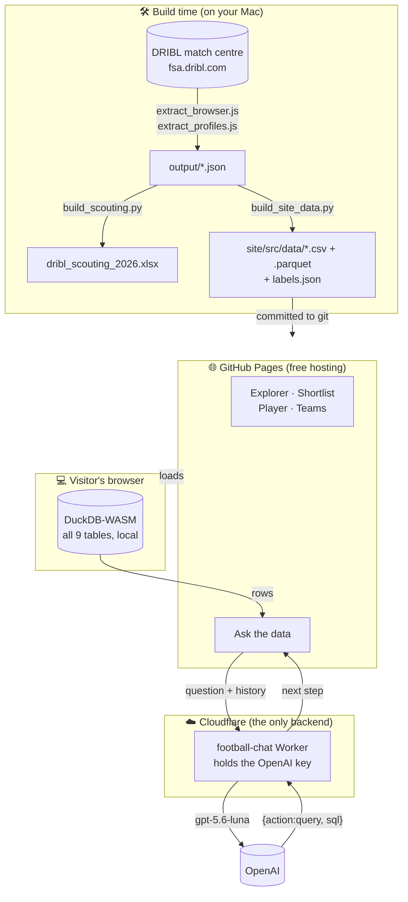
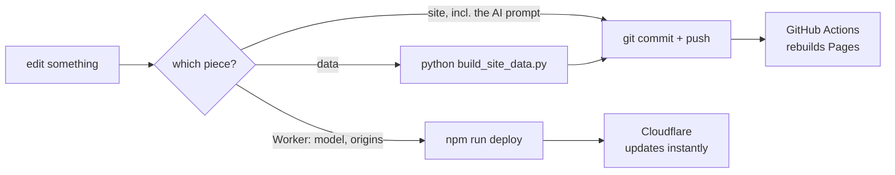

# SA State League Scouting — How the whole thing works

Plain-language guide to what this project is, how the pieces fit, why it was built this
way, and — most importantly — **where to change things and how to ship them**. If you
only read one section, read [The golden rule](#the-golden-rule-edit-the-builders-not-their-output)
and [Deploy / build workflow](#deploy--build-workflow).

For narrower details this doc links out to [README.md](README.md) (data refresh + deps),
[chat-worker/README.md](chat-worker/README.md) (the AI helper) and `SESSION_LOG.md`
(how the DRIBL extraction was worked out).

---

## What this is, in one breath

A scouting tool for South Australian State League football. It has five pages: an
**Explorer** (any metric against any other), a **Shortlist** (ranked by a gem score), a
**Player profile**, **Teams & ladders**, and **Ask the data** — a chatbot you can ask
questions in plain English.

There is **no login and no database**. Python scripts turn raw DRIBL dumps into a handful
of small CSV/Parquet files, those are committed, and the site is a static build on GitHub
Pages. The only moving server-side part is a tiny helper that answers chat questions
(because that needs a secret key that can't live in a public web page).

---

## The big picture



**The one-sentence version:** Python bakes the data into small committed files → GitHub
Pages serves them as a static site → the browser does all the querying in DuckDB-WASM →
and *only* the chat page reaches out to a small Cloudflare Worker that safely holds the
AI key.

---

## The three pieces

### 1. The data pipeline (Python, run by hand)

**What:** turns the DRIBL match centre into ~4 MB of committed tables.

**How:** DRIBL sits behind Cloudflare, so extraction runs *inside a browser tab*
(`extract_browser.js`, `extract_profiles.js`) rather than from Python. `merge_dumps.py`
stitches the chunks together; `build_scouting.py` computes every derived metric;
`build_site_data.py` writes the compact files the site reads.

**Why this way:** Cloudflare blocks server-side clients, so the browser is the only way in.
Everything downstream is deterministic and re-runnable from the raw dump.

`output/` (raw dumps, workbook — 183 MB) is git-ignored. Only `site/src/data/` is committed.

### 2. The site (Observable Framework → GitHub Pages)

**What:** five pages, no framework beyond Observable, no runtime dependencies.

**How:** the committed CSV/Parquet are loaded as `FileAttachment`s, and pages that need
real querying declare tables in their front matter:

```yaml
sql:
  players: ./data/players.csv
  appearances: ./data/appearances.parquet
```

Framework registers each file in **DuckDB-WASM** in the browser, so `sql` is a real SQL
engine over the real data with no server involved.

**Why this way:**
- *Static + committed data* → free hosting, nothing to run, no database to maintain.
- *DuckDB in the browser* → real SQL (joins, window functions, aggregates) at zero
  infrastructure cost. This is what makes the chat page possible at all.
- *`labels.json` as the single source of column wording* → the Explorer's axis menus, the
  table headers and the chatbot's schema description all read from one file.

### 3. The chat Worker (`chat-worker/`)

**What:** a ~250-line [Cloudflare Worker](https://developers.cloudflare.com/workers/) —
the *only* backend — that turns a question into SQL and SQL results into prose.

**How:** the page sends the question plus a schema prompt built from `labels.json` and
`notes.json`. The Worker calls **OpenAI** and returns one of two things:

```js
{action: "query",  sql: "SELECT …"}   // the page runs this in DuckDB, then asks again
{action: "answer", answer: "…"}       // done
```

The **browser owns the loop** (max 3 queries); the Worker is single-shot and stateless.

**Why this way:**
- *A backend at all* → an AI call needs a secret key, and a public page can't hold a secret.
- *The Worker never sees football data* → the data is already in the browser, so the Worker
  stays a tiny credential relay with nothing to store and nothing to maintain.
- *Truthfulness is structural* → the model only chooses **what to ask**. Every number in an
  answer came from a query the page actually ran, and that SQL is always shown under the
  answer. It cannot invent a goal tally.
- *Lives in this repo*, unlike `lolo/rr-tailor-worker` which has its own — nothing secret is
  in the file, and `deploy.yml`'s `paths: ["site/**"]` filter means a Worker change doesn't
  trigger a pointless Pages rebuild. One repo, one push.

---

## Key design decisions & why

| Decision | Why |
| --- | --- |
| Static site on GitHub Pages | Free, nothing to run. It's a tool for one person. |
| Data committed as CSV/Parquet | No database; a data refresh is a normal commit. |
| DuckDB-WASM in the browser | Real SQL over real data with no server. |
| Extraction runs in a browser tab | Cloudflare blocks server-side clients. |
| `labels.json` as one source of truth | Axis menus, headers and the AI schema prompt all agree. |
| Chat answers must come from SQL | A wrong stat is worse than no answer; the query is the receipt. |
| Schema prompt built in the browser | Tuning the prompt is a page edit, not a Worker redeploy. |
| One small Worker as the only backend | The single thing that needs a secret key. |

---

## The golden rule: edit the builders, not their output

> **These files are generated. Do NOT edit them by hand — your changes get wiped the next
> time the builder runs.**

| Generated file | Regenerated by |
| --- | --- |
| `site/src/data/*` (all 13 files) | `build_site_data.py` |
| `site/src/components/crests.js` | `download_crests.py` |
| `site/src/fonts.css` | `build_fonts.py` |
| `output/*` | `build_scouting.py` |
| `site/dist/` | `npm run build` |

---

## Where to edit what

| I want to change… | Edit this | Then |
| --- | --- | --- |
| A column's name, description or "higher is better" | the `LABELS` dict in `build_site_data.py` | re-run `build_site_data.py` |
| A derived metric or the shortlist gem score | `build_scouting.py` | re-run it, then `build_site_data.py` |
| The Explorer / Shortlist / Teams / Player pages | `site/src/*.md` | commit + push |
| The chatbot's SQL rules, grain warnings or tone | `site/src/components/schema-prompt.js` | commit + push (**no Worker redeploy**) |
| The chat retry loop or SQL guard | `site/src/components/chat-agent.js` | commit + push |
| The chat model or its reasoning effort | `MODEL` / `REASONING_EFFORT` in `chat-worker/worker.js` | **redeploy the Worker** |
| Which origins may call the Worker | `ALLOWED_ORIGINS` in `chat-worker/worker.js` | **redeploy the Worker** |
| Styling for any page | `site/src/style.css` | commit + push |
| Which pages appear in the sidebar | `site/observablehq.config.js` | commit + push |

> **The prompt lives in the site, not the Worker** — on purpose. Prompt tuning is the thing
> you iterate on most, and this way it ships with a normal push instead of a Cloudflare deploy.

---

## Deploy / build workflow

There are **two deploy targets**, and they are independent.

### A. Change the site (any page, style, or the chat prompt)

```bash
cd /Users/satyaveer/projects/football/site
npm run build          # optional: catches errors before CI does
cd .. && git add -A && git commit -m "…" && git push
```

GitHub Actions (`.github/workflows/deploy.yml`) rebuilds and publishes within a minute or
two. It only fires for changes under `site/**`.

### B. Change the chat Worker

The Worker deploys to **Cloudflare, not GitHub** — a separate step.

```bash
cd /Users/satyaveer/projects/football/chat-worker
npm run deploy                 # this is what changes live behaviour
cd .. && git add -A && git commit -m "…" && git push
```

Deploying and committing are two different things: `npm run deploy` changes what visitors
get, the `git push` is the backup. To set or rotate the OpenAI key: `npm run secret` — it
goes straight to Cloudflare and is never written to disk.

For local work, `.dev.vars` holds either `CHAT_MOCK="1"` (no key, no spend — the mock walks
the same two-phase shape as the real model) or a real `OPENAI_API_KEY`. It is gitignored;
only `.dev.vars.example` is committed.

### C. Refresh the data

See [README.md](README.md#refresh-the-data). Ends with committing `site/src/data` and pushing.

### The mental model



---

## Running it locally

```bash
cd site && npm install && npm run dev        # http://127.0.0.1:3101
```

For the chat page you also need the Worker, in a second terminal:

```bash
cd chat-worker && npm install && npm run dev  # http://127.0.0.1:8787
```

The page picks its endpoint by hostname: `127.0.0.1`/`localhost` → the local Worker,
anything else → the deployed one. No build-time configuration.

---

## Quick facts

- **Live site:** https://satpat.github.io/football-scouting/
- **Repo:** `Satpat/football-scouting`, Pages deploys from `main` via Actions
- **Chat Worker:** `https://football-chat.veerlo.workers.dev` (Cloudflare)
- **Cost:** hosting is free; a chat question is roughly **$0.007** on `gpt-5.6-luna`
- **Node:** 24 (`.nvmrc`), matching CI
- **Season 2026:** 981 matches · 2,132 players · 3,233 player-seasons · 96 teams · 12 leagues
