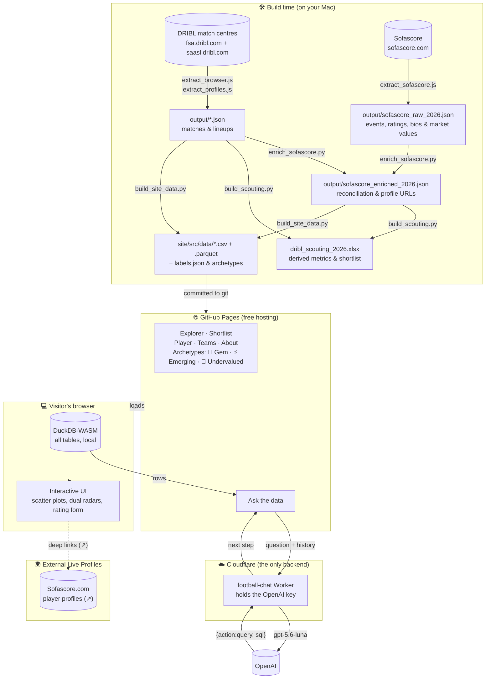
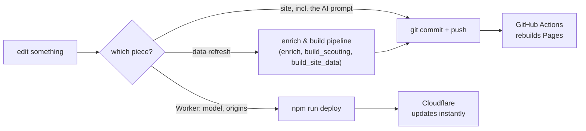

# SA State League Scouting — How the whole thing works

Plain-language guide to what this project is, how the pieces fit, why it was built this
way, and — most importantly — **where to change things and how to ship them**. If you
only read one section, read [The golden rule](#the-golden-rule-edit-the-builders-not-their-output)
and [Deploy / build workflow](#deploy--build-workflow).

For narrower details this doc links out to [README.md](README.md) (data refresh + deps),
[chat-worker/README.md](chat-worker/README.md) (the AI helper) and `SESSION_LOG.md`
(how the DRIBL extraction was worked out).

---

## What this is, in one breath

A scouting tool for South Australian football. It has six pages: an
**Explorer** (any metric against any other, with quick preset buttons), a **Shortlist** (ranked by gem score, Sofascore rating, or xG/90), a
**Player profile** (career history, standard and advanced radar traits, Sofascore match logs), **Teams & ladders** (actual vs expected goals), **Ask the data** — a chatbot you can ask
questions in plain English, and an **About** methodology page. The dataset spans four divisions across two separate
governing bodies' DRIBL sites: Football SA's **SL1**, **SL2** and **NPL** (the RAA
National Premier League, men's), and **SAASL** (the SA Amateur Soccer League)'s full
Home and Away competition, enriched with advanced statistical event data from **Sofascore** — see [Data sources](#data-sources-two-dribl-tenants) below.

There is **no login and no database**. Python scripts turn raw DRIBL dumps and Sofascore event data into a handful
of small CSV/Parquet files, those are committed, and the site is a static build on GitHub
Pages. The only moving server-side part is a tiny helper that answers chat questions
(because that needs a secret key that can't live in a public web page).

---

## The big picture



**The one-sentence version:** Python bakes the data into small committed files → GitHub
Pages serves them as a static site → the browser does all the querying in DuckDB-WASM →
and *only* the chat page reaches out to a small Cloudflare Worker that safely holds the
AI key.

---

## The three pieces

### 1. The data pipeline (Python, run by hand)

**What:** turns two DRIBL match centres into a handful of committed tables.

**How:** DRIBL sits behind Cloudflare, so extraction runs *inside a browser tab*
(`extract_browser.js`, `extract_profiles.js`) rather than from Python. `merge_dumps.py`
stitches the chunks together; `build_scouting.py` computes every derived metric;
`build_site_data.py` writes the compact files the site reads.

**Why this way:** Cloudflare blocks server-side clients, so the browser is the only way in.
Everything downstream is deterministic and re-runnable from the raw dump.

`output/` (raw dumps, workbook) is git-ignored. Only `site/src/data/` is committed.

#### Data sources: two DRIBL tenants

DRIBL is a shared platform — each governing body gets its own site, tenant id and season
id on it. This project pulls from two, merged into one raw dump:

| Source | Site | Tenant | Season | Scope pulled |
| --- | --- | --- | --- | --- |
| Football SA | fsa.dribl.com | `3pmvvjLmvJ` | `7MNGzMbmAz` | SL1, SL2, NPL (men's) — all grades incl. finals |
| SAASL (SA Amateur Soccer League) | saasl.dribl.com | `V8dnR1odwL` | `7MNGzzEmAz` | Home and Away only (24 grades) |

The exact ids and the competition ids per division live in `extract_browser.js`'s header
comment — treat that as the source of truth, not this table, if they ever drift.

**Deliberately excluded** (same "no trials/cups" convention applied to both sources):
NPL Women's (a separate competition, `LBdDxx9Jdb`), and on the SAASL side, SAASL Cups,
preseason trials, and the one-off shields/challenges outside Home and Away.

**Finding a new tenant id**, if another competition gets added later: `fsa.dribl.com`'s
own hardcoded id was found by watching the Performance API panel; the general technique
is `GET mc-api.dribl.com/api/tenants?slug=<the site's URL slug>` (e.g. `?slug=saasl`) —
`?hostname=` does *not* work despite looking like it should. Most `mc-api` endpoints
(`competitions`, `results`, `ladders`, the `memberprofile*` ones) don't actually require
`tenant` if `season` is given; only `matchcentre/{id}` does.

**Known data-quality gap:** SAASL is amateur/community football, volunteer-scored, and it
shows — about 28% of SAASL matches have no goal-event timeline at all (`match_events` is
missing or empty), even though the lineup's own goal tally is still recorded. This means
`build_scouting.py --check`'s "goal events vs lineup goals" reconciliation will always
show a MISMATCH once SAASL is in the dump (expected, not a bug), and the game-state columns
(`goals_equaliser`, `goals_go_ahead`, `goals_winner`, `goals_late`) and the Events sheet
undercount for SAASL. Football SA's (SL1/SL2/NPL) timelines are essentially complete.
Documented for end users in the "Game state" method note (`about.md`).

**One real DRIBL quirk found and fixed:** the `memberprofile-matches` endpoint returns
`minutes: false` (a bool, not `null`) for some unrecorded SAASL matches — `pyarrow` refused
to write a column mixing `int` and `bool`. Fixed by coercing bools to `None` in
`member_match_frame()` (`build_site_data.py`) before the parquet write.

**One real code bug found and fixed:** `player.md`'s match-history "cup" badge used to be
`!/State League/.test(r.league)` — a hardcoded substring check that would have wrongly
tagged every NPL and SAASL match as a "cup" match once they became first-class divisions.
Replaced with `isGradedLeague()` (`labels.js`), which checks league membership against
`leagues.json` instead of guessing from the name.

#### Sofascore enrichment (Advanced stats, metrics & scouting badges)

To complement DRIBL's basic match events, detailed match metrics (xG, xA, key passes, duels, passing accuracy, tackles, interceptions, clearances, dribbles, physical profiles, market values, and ratings) are pulled from Sofascore:

1. **Extraction (`extract_sofascore.js`)**: Runs directly in the browser DevTools session to bypass Cloudflare TLS fingerprinting and rate limits. Scrapes tournament schedules, finished match events, detailed lineups, incidents, and player profiles across 7 South Australian tournaments:
   - RAA NPL South Australia (`1258`, season `88847`)
   - State League 1 (`26016`, season `88849`)
   - State League 2 (`32070`, season `88894`)
   - State League 2 Reserves (`32103`, season `89000`)
   - State League 2 South (`27357`, season `76898`)
   - Saturday Division 2 (`34182`, season `93152`)
   - Saturday Premier A (`32825`, season `91200`)
   Outputs raw event data to `output/sofascore_raw_2026.json`. Also provides `__sofa.players()` to extract individual player bios, preferred foot, and attribute overviews.

2. **Reconciliation (`enrich_sofascore.py`)**:
   - Reconciles matches by fixture date, home/away club alias normalization, and competition grade.
   - Resolves individual player lineups against DRIBL member profiles using name normalization and DRIBL's `user_hash_id`.
   - Ingests physical attributes (date of birth, height in cm, Sofascore player ID, slug, headshots, market values).
   - Generates direct live profile links (`sofascore_url`: `https://www.sofascore.com/football/player/${slug}/${id}`).
   - Generates `output/sofascore_enriched_2026.json` mapping DRIBL match hashes and player appearance IDs to Sofascore metrics.

3. **Pipeline Ingestion & Metric Derivation (`build_scouting.py`)**:
   - **Appearance Level**: Ingests 30+ event stats: accurate passes, total passes, duel win/loss, aerial win/loss, dribbles, tackles, interceptions, clearances, recoveries, saves, saves inside box, xG, xA, key passes, big chances created, rating.
   - **Player Season Aggregations**: Computes per-90 rates, percentage accuracies, and analytical differentials:
     - *Attacking & Efficiency*: `xg`, `xg_p90`, `xa`, `xa_p90`, `finishing_delta` ($G - xG$), `assist_delta` ($A - xA$), `key_passes_p90`, `big_chances_created`, `shot_acc_pct`, `xg_per_shot`.
     - *Passing & Retention*: `passes_p90`, `pass_acc_pct`, `long_balls_p90`, `long_ball_acc_pct`.
     - *Duels & Defending*: `duels_p90`, `duel_win_pct`, `aerials_p90`, `aerial_win_pct`, `tackles_p90`, `interceptions_p90`, `recoveries_p90`, `clearances_p90`, `defensive_actions_p90`.
     - *Carrying & Involvement*: `dribbles_p90`, `dribble_success_pct`, `touches_p90`.
     - *Goalkeeping*: `saves`, `saves_p90`, `saves_inside_box`.
     - *Valuation & Profile*: `market_value_eur`, `sofascore_url`, `sofascore_id`.
   - **Team Context**: Regular season `team_xg_per_match`, `team_xga_per_match`, `team_xgd_per_match`, and `avg_possession_pct`.
   - **Null Integrity**: Players in non-tracked leagues (SL2, SAASL) cleanly preserve `np.nan` / `null` rather than filling with 0, preventing distortion of percentiles or false clustering at the chart origin.

### 4. **Scouting Archetypes & Tags (`build_site_data.py`)**

#### ⚡ Emerging Senior

U21 players (`age <= 21` or `u18_player`) playing Senior NPL (`grade == 'SEN'` & `division == 'NPL'`) who demonstrate top-tier impact via:

**Criteria**

> $$\text{Sofascore Rating} \ge 7.0 \quad \text{OR} \quad (xG/90 + xA/90) \ge 0.40$$
>
> *Surfaces young players proving themselves at the highest state level; 32 players tagged.*

---

#### 🎯 Undervalued Performer

Players on bottom-half **NPL** teams (`division == 'NPL'`, `ladder_pos > teams / 2`, min 450 minutes) who excel in possession or defensive phases:

**Criteria**

> $$\text{Duel Win Rate} \ge 60\% \quad \text{OR} \quad \text{Pass Accuracy} \ge 80\%$$
>
> *Identifies quality players whose stats may be masked by a struggling NPL team; 27 players tagged.*

---

#### 💎 Universal Hidden Gem

Unpromoted Reserves/U18 players with zero senior minutes all season.

---

> **Shortlist output:** Populates plain-English explanations directly into `why_flagged` (e.g. *"Emerging Senior (U21 standout in Senior NPL)"*, *"Undervalued Performer on #7 NPL team"*).

### 5. **Static Site Integration**:
   - **Explorer (`site/src/index.md`)**: Promoted archetype toggles with native hover tooltips; preset buttons (Finishing, Creation, Ball Winning, Duels, Retention); detail card badges and direct Sofascore profile link; market value indicator; table external link icons (`↗`).
   - **Player Profile (`site/src/player.md`)**: Physical bio strip (DOB, height, market value); sky-blue "Sofascore profile ↗" hero action button; clickable Sofascore fact link; advanced stats grid; percentile radar toggle (*Standard Traits* vs *Sofascore Advanced Traits*); interactive Sofascore rating trend bar chart with 7.0 benchmark line; color-coded match rating badges; match xG.
   - **Teams & Ladders (`site/src/teams.md`)**: Actual Goals vs Expected Goals (xG vs xGA) scatter plot toggle and average possession % in the ladder table.
   - **Shortlist (`site/src/shortlist.md`)**: Promoted archetype toggles with hover descriptions; automatic hiding of blank Sofascore columns when Hidden Gems is selected; optional market value column; Sort by Gem score, Sofascore rating, or xG/90; table badges with explanatory tooltips and external Sofascore link icons (`↗`).
   - **About (`site/src/about.md`)**: Side-by-side 2-column layout comparing DRIBL administrative baseline vs Sofascore advanced event tracking.

### 2. The site (Observable Framework → GitHub Pages)

**What:** six pages (Explorer, Shortlist, Player profile, Teams & ladders, Ask the data, and About), no framework beyond Observable, no runtime dependencies. The layout is mobile-responsive — Explorer grids stack via container queries, tables scroll horizontally with gradient affordance hints, tooltips are touch-accessible via `focus-within`, and phone-specific breakpoints at 640px/480px adjust typography, spacing and grid tracks.

**How:** the committed CSV/Parquet are loaded as `FileAttachment`s, and pages that need
real querying declare tables in their front matter:

```yaml
sql:
  players: ./data/players.csv
  appearances: ./data/appearances.parquet
```

Framework registers each file in **DuckDB-WASM** in the browser, so `sql` is a real SQL
engine over the real data with no server involved.

**Why this way:**
- *Static + committed data* → free hosting, nothing to run, no database to maintain.
- *DuckDB in the browser* → real SQL (joins, window functions, aggregates) at zero
  infrastructure cost. This is what makes the chat page possible at all.
- *`labels.json` as the single source of column wording* → the Explorer's axis menus, the
  table headers and the chatbot's schema description all read from one file.

### 3. The chat Worker (`chat-worker/`)

**What:** a ~250-line [Cloudflare Worker](https://developers.cloudflare.com/workers/) —
the *only* backend — that turns a question into SQL and SQL results into prose.

**How:** the page sends the question plus a schema prompt built from `labels.json` and
`notes.json`. The Worker calls **OpenAI** and returns one of two things:

```js
{action: "query",  sql: "SELECT …"}   // the page runs this in DuckDB, then asks again
{action: "answer", answer: "…"}       // done
```

The **browser owns the loop** (max 3 queries); the Worker is single-shot and stateless.

**Why this way:**
- *A backend at all* → an AI call needs a secret key, and a public page can't hold a secret.
- *The Worker never sees football data* → the data is already in the browser, so the Worker
  stays a tiny credential relay with nothing to store and nothing to maintain.
- *Truthfulness is structural* → the model only chooses **what to ask**. Every number in an
  answer came from a query the page actually ran, and that SQL is always shown under the
  answer. It cannot invent a goal tally.
- *Lives in this repo*, unlike `lolo/rr-tailor-worker` which has its own — nothing secret is
  in the file, and `deploy.yml`'s `paths: ["site/**"]` filter means a Worker change doesn't
  trigger a pointless Pages rebuild. One repo, one push.

---

## Key design decisions & why

| Decision | Why |
| --- | --- |
| Static site on GitHub Pages | Free, nothing to run. It's a tool for one person. |
| Data committed as CSV/Parquet | No database; a data refresh is a normal commit. |
| DuckDB-WASM in the browser | Real SQL over real data with no server. |
| Extraction runs in a browser tab | Cloudflare blocks server-side clients (both on DRIBL and Sofascore). |
| Sofascore browser extraction & reconciliation | Cloudflare WAF on Sofascore blocks headless scraping; browser extraction dumps raw JSON. Offline Python reconciliation uses fuzzy name matching and DRIBL `user_hash_id` to cleanly bridge the two data silos without an external database. |
| Preserving nulls for unmeasured leagues | Lower divisions (SL2, SAASL) lack Sofascore event tracking. Keeping these as `null` / `np.nan` instead of filling with zeros prevents distorted league-wide percentiles and false clusters at the chart origin. |
| Multi-archetype scouting tags | Rather than overloading `hidden_gem` (which specifically isolates unpromoted Reserves/U18 talent), `emerging_senior` (U21 standouts in Senior NPL) and `undervalued_performer` (performers on bottom-half NPL sides) provide orthogonal scouting lenses without altering core `gem_score`. |
| `labels.json` as one source of truth | Axis menus, headers and the AI schema prompt all agree. |
| Chat answers must come from SQL | A wrong stat is worse than no answer; the query is the receipt. |
| Schema prompt built in the browser | Tuning the prompt is a page edit, not a Worker redeploy. |
| One small Worker as the only backend | The single thing that needs a secret key. |
| Multiple DRIBL tenants, one pipeline | Football SA and SAASL are separate governing bodies/DRIBL sites; both flow through the same extraction → merge → build scripts, tagged by a coarse `division` column, instead of per-source code paths. |
| Mobile-responsive via CSS only | All responsive behaviour lives in `style.css` — container queries for Explorer grids, media-query breakpoints at 640px/480px for phones/tablets, `@media (hover: hover)` to gate hover-only tooltips, scroll-affordance shadows on tables. No JS layout logic, no separate mobile pages; the same markup adapts. |

---

## The golden rule: edit the builders, not their output

> **These files are generated. Do NOT edit them by hand — your changes get wiped the next
> time the builder runs.**

| Generated file | Regenerated by |
| --- | --- |
| `site/src/data/*` (all 13 files) | `build_site_data.py` |
| `site/src/components/crests.js` | `download_crests.py` |
| `site/src/fonts.css` | `build_fonts.py` |
| `output/dribl_*.json` | `merge_dumps.py` |
| `output/sofascore_raw_2026.json` | `extract_sofascore.js` |
| `output/sofascore_enriched_2026.json` | `enrich_sofascore.py` |
| `output/*.xlsx` | `build_scouting.py` |
| `site/dist/` | `npm run build` |

---

## Where to edit what

| I want to change… | Edit this | Then |
| --- | --- | --- |
| A column's name, description or "higher is better" | the `LABELS` dict in `build_site_data.py` | re-run `build_site_data.py` |
| A derived metric or the shortlist gem score | `build_scouting.py` | re-run it, then `build_site_data.py` |
| Scouting tags & criteria (`emerging_senior`, `undervalued_performer`) | `build_site_data.py` (and notes in `build_scouting.py`) | re-run `build_site_data.py`, commit + push |
| Sofascore tournament IDs / scrape scope | `extract_sofascore.js` | re-run extraction, then `enrich_sofascore.py` |
| Club aliases & player matching heuristics | `enrich_sofascore.py` | re-run `enrich_sofascore.py`, then build scripts |
| The Explorer / Shortlist / Teams / Player pages | `site/src/*.md` | commit + push |
| The chatbot's SQL rules, grain warnings or tone | `site/src/components/schema-prompt.js` | commit + push (**no Worker redeploy**) |
| The chat retry loop or SQL guard | `site/src/components/chat-agent.js` | commit + push |
| The chat model or its reasoning effort | `MODEL` / `REASONING_EFFORT` in `chat-worker/worker.js` | **redeploy the Worker** |
| Which origins may call the Worker | `ALLOWED_ORIGINS` in `chat-worker/worker.js` | **redeploy the Worker** |
| Styling for any page | `site/src/style.css` | commit + push |
| Mobile breakpoints, touch tooltips, scroll affordances | the `Mobile-responsive enhancements` block at the bottom of `site/src/style.css` | commit + push |
| Which pages appear in the sidebar | `site/observablehq.config.js` | commit + push |
| Which competitions/divisions are extracted | `COMPS`/`TENANT`/`SEASON` in `extract_browser.js` (header comment has both current sources) | re-run extraction + `merge_dumps.py`, then the build scripts |
| A division code or a league's sponsor prefix | `DIVISION_BY_COMPETITION` in `build_scouting.py`; sponsor stripping in `shortLeague()` (`labels.js`) and `league_order()` (`build_site_data.py`) | re-run `build_site_data.py`, commit + push |

> **The prompt lives in the site, not the Worker** — on purpose. Prompt tuning is the thing
> you iterate on most, and this way it ships with a normal push instead of a Cloudflare deploy.

---

## Deploy / build workflow

There are **two deploy targets**, and they are independent.

### A. Change the site (any page, style, or the chat prompt)

```bash
cd /Users/satyaveer/projects/football/site
npm run build          # optional: catches errors before CI does
cd .. && git add -A && git commit -m "…" && git push
```

GitHub Actions (`.github/workflows/deploy.yml`) rebuilds and publishes within a minute or
two. It only fires for changes under `site/**`.

### B. Change the chat Worker

The Worker deploys to **Cloudflare, not GitHub** — a separate step.

```bash
cd /Users/satyaveer/projects/football/chat-worker
npm run deploy                 # this is what changes live behaviour
cd .. && git add -A && git commit -m "…" && git push
```

Deploying and committing are two different things: `npm run deploy` changes what visitors
get, the `git push` is the backup. To set or rotate the OpenAI key: `npm run secret` — it
goes straight to Cloudflare and is never written to disk.

For local work, `.dev.vars` holds either `CHAT_MOCK="1"` (no key, no spend — the mock walks
the same two-phase shape as the real model) or a real `OPENAI_API_KEY`. It is gitignored;
only `.dev.vars.example` is committed.

### C. Refresh the data

Full data refresh sequence from both DRIBL and Sofascore:

```bash
# 1. In browser DevTools on fsa.dribl.com and saasl.dribl.com:
#    Run extract_browser.js, then extract_profiles.js
# 2. In browser DevTools on sofascore.com:
#    Run extract_sofascore.js
# 3. Process, reconcile, and build:
python merge_dumps.py
python enrich_sofascore.py
python build_scouting.py
python build_site_data.py
cd site && npm run build
```

Ends with committing `site/src/data/` and pushing.

### The mental model



---

## Running it locally

```bash
cd site && npm install && npm run dev        # http://127.0.0.1:3101
```

For the chat page you also need the Worker, in a second terminal:

```bash
cd chat-worker && npm install && npm run dev  # http://127.0.0.1:8787
```

The page picks its endpoint by hostname: `127.0.0.1`/`localhost` → the local Worker,
anything else → the deployed one. No build-time configuration.

---

## Quick facts

- **Live site:** https://satpat.github.io/football-scouting/
- **Repo:** `Satpat/football-scouting`, Pages deploys from `main` via Actions
- **Chat Worker:** `https://football-chat.veerlo.workers.dev` (Cloudflare)
- **Cost:** hosting is free; a chat question is roughly **$0.007** on `gpt-5.6-luna`
- **Node:** 24 (`.nvmrc`), matching CI
- **Season 2026:** 3,139 matches · 7,007 players · 11,683 player-seasons · 331 teams ·
  39 leagues across 4 divisions (SL1, SL2, NPL, SAASL)
- **Sofascore enrichment:** 880 matches and 131 event lineups reconciled across 622 DRIBL matches;
  354 players enriched with physical bios, market values, and direct Sofascore profile links;
  32 Emerging Seniors and 27 Undervalued Performers tagged.
